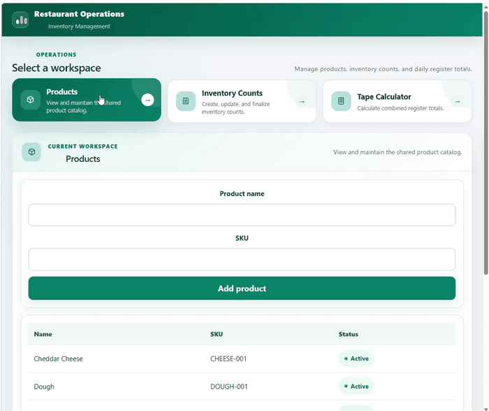
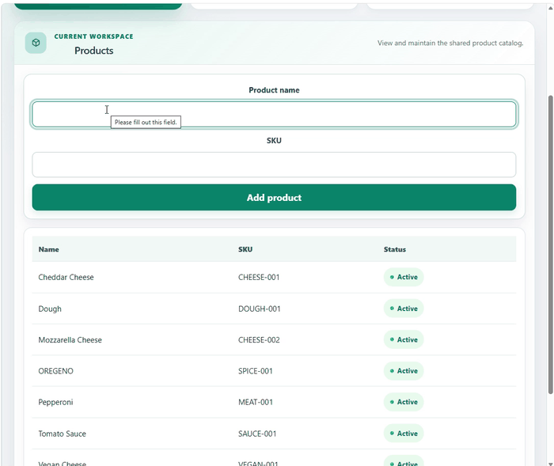

# Hi, I'm Courtney O'Donnell 👋

I'm a full-stack .NET developer with a passion for building modern applications using the Microsoft ecosystem. I enjoy creating clean APIs, intuitive user interfaces, and cross-platform solutions that solve real business problems.

**Current focus:** ASP.NET Core • C# • React • TypeScript • Flutter • SQL Server • Entity Framework Core

---

# 🍽 Featured Project — Restaurant Operations

A full-stack restaurant inventory management platform built with **ASP.NET Core 8**, **Entity Framework Core**, **SQL Server**, **React**, and **Flutter**.

The platform demonstrates how multiple client applications can share a single backend while keeping business rules centralized in the API.

## Tech Stack

- ASP.NET Core 8
- Entity Framework Core
- SQL Server
- React + TypeScript + Vite
- Flutter + Dart
- REST APIs

---

# 🎥 Product Management

> Create and manage products from the React administrative portal.

  

---

# 🎥 Inventory Workflow

> Start an inventory count, add products, and review count history.

  

---

# 📱 Mobile Companion

The Flutter application connects to the same ASP.NET Core API, allowing inventory tasks to be completed from a mobile device while sharing the same business rules and data.

  

---

# 📂 Repositories

### 🌐 Restaurant Operations

Full solution including:

- ASP.NET Core Web API
- React Administrative Portal
- Entity Framework Core
- SQL Server
- xUnit Tests

➡️ **Repository:**  
https://github.com/CourtneyODonnell/restaurant-operations

---

### 📱 Restaurant Operations Mobile

Flutter client consuming the shared backend API.

➡️ **Repository:**  
https://github.com/CourtneyODonnell/restaurant-operations-mobile

---

# 🚀 Currently Learning

- Advanced ASP.NET Core
- Azure deployment
- Docker
- CI/CD with GitHub Actions
- Clean Architecture

---

# 📫 Connect

- GitHub: https://github.com/CourtneyODonnell